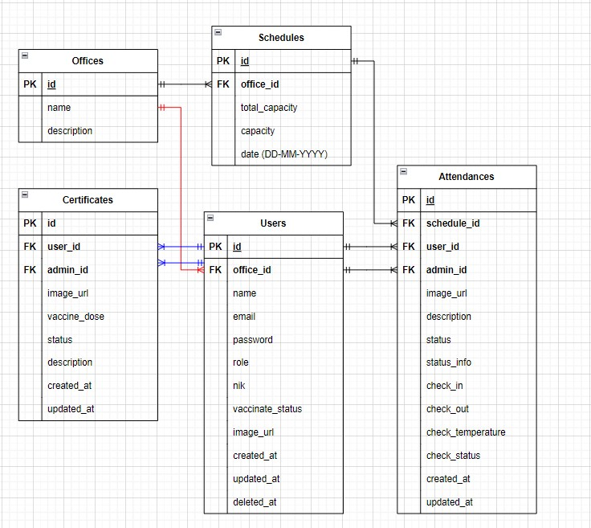
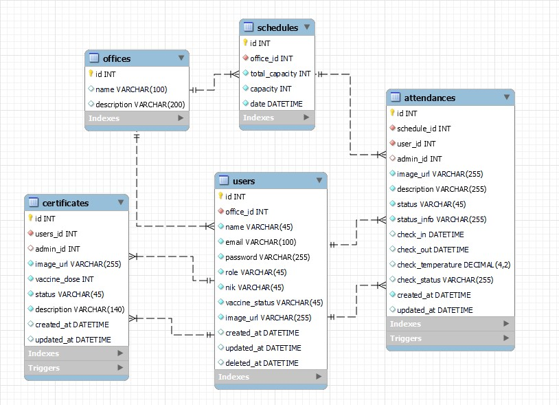

# Safety Protocol App

<br/>
<div align="center">
  <a href="">
    
  </a>
  <p align="center">
    Sebuah aplikasi New Normal Tracker App yang menggunakan RESTful API
  </p>
</div>

### 🛠 &nbsp;Build App & Database

&nbsp;
&nbsp;
&nbsp;
&nbsp;
&nbsp;
&nbsp;
&nbsp;
&nbsp;

## 💻 &nbsp;About The Project

<details>
<summary>ERD</summary>

</details>

<details>
<summary>MYSQL Schema</summary>

</details>

<details>
<summary>🛠️ Features</summary>
<br><details>
<summary>🔒 &nbsp;Authentication</summary>
  
| Feature User | Endpoint | Query Param | Request Body | JWT Token | Admin Only | Fungsi |
| --- | --- | --- | --- | --- | --- | --- |
| POST | /register | - | - | NO | NO | Register akun user / pegawai |
| POST | /login  | - | - | NO | NO | Login ke dalam sistem |

</details>

<details>
<summary>👨‍💼 &nbsp;Users</summary>
  
| Feature User | Endpoint | Query Param | Request Body | JWT Token | Admin Only | Fungsi |
| --- | --- | --- | --- | --- | --- | --- |
| GET | /profile | - | - | YES | NO | Get data user yang sedang login |
| GET | /users/:id  | - | - | YES | YES | Get data user tertentu |
| PUT | /users/:id | - | name, email, password, image | YES | NO | Edit data user |
| DELETE | /users/:id  | - | - | YES | NO | Delete data user |

</details>

<details>
<summary>🏢 &nbsp;Office</summary>
  
| Feature User | Endpoint | Query Param | Request Body | JWT Token | Admin Only | Fungsi |
| --- | --- | --- | --- | --- | --- | --- |
| GET | /offices | - | - | YES | NO | Get list data office |
| GET | /offices/:id  | - | - | YES | NO | Get data office tertentu |

</details>

<details>
<summary>🗓️ &nbsp;Schedule</summary>
  
| Feature User | Endpoint | Query Param | Request Body | JWT Token | Admin Only | Fungsi |
| --- | --- | --- | --- | --- | --- | --- |
| GET | /schedules | page, month, year, office | - | YES | NO | Get list data schedule untuk WFO |
| POST | /schedules  | - | office_id, total_capacity, month, year | YES | YES | Menambahkan data schedule di office, bulan dan tahun tertentu |
| GET | /schedules/:id | page | - | YES | NO | Get data schedule beserta partisipannya |
| PUT | /schedules/:id  | - | total_capacity | YES | YES | Edit total capacity pada sebuah schedule |

</details>
 
<details>
<summary>📃 &nbsp;Certificates</summary>
  
| Feature User | Endpoint | Query Param | Request Body | JWT Token | Admin Only | Fungsi |
| --- | --- | --- | --- | --- | --- | --- |
| GET | /certificates | page, status | - | YES | YES | Get list data user dan masing-masing sertifikat vaksin |
| POST | /certificates  | - | vaccinedose, image, description | YES | NO | Menambahkan data sertifikat vaksin user |
| GET | /mycertificates| - | - | YES | NO | Get data sertifikat vaksin dari user yang sedang login |
| PUT | /mycertificates/:id  | - | image | YES | NO | Edit sertifikat vaksin jika pengajuan ditolak oleh admin |
| GET | /certificates/:id | - | - | YES | NO | Get data sertifikat vaksin berdasarkan id sertifikat |
| PUT | /certificates/:id  | - | status | YES | YES | Edit status pengajuan sertifikat vaksin |

</details>

<details>
<summary>🖥️ &nbsp;Attendances</summary>
  
| Feature User | Endpoint | Query Param | Request Body | JWT Token | Admin Only | Fungsi |
| --- | --- | --- | --- | --- | --- | --- |
| POST | /attendances | - | schedule_id, description, image | YES | NO | Booking jadwal WFO |
| PUT | /attendances/:id  | - | schedule_id, status, status_info | YES | YES | Edit status booking WFO |
| GET | /attendances/:id| - | - | YES | NO | Get data booking WFO by id |
| GET | /myattendances  | page, status | - | YES | NO | Get list data booking WFO dari user yang sedang login |
| GET | /mylatestattendances | page, status | - | YES | NO | Get list data booking WFO dari user yang sedang login dan diurutkan dari tanggal terbaru|
| GET | /mylongestattendances  | page, status | - | YES | NO | Get list data booking WFO dari user yang sedang login dan diurutkan dari tanggal terjauh |
| GET | /pendingattendances  | page | - | YES | YES | Get list data booking WFO yang berstatus pending |

</details>

<details>
<summary>🖥️ &nbsp;Check In and Check Out</summary>
  
| Feature User | Endpoint | Query Param | Request Body | JWT Token | Admin Only | Fungsi |
| --- | --- | --- | --- | --- | --- | --- |
| GET | /checks | page | - | YES | YES | Get list user dan data check in dan checkout |
| GET | /checks/:id  | - | - | YES | NO | Get data check in dan check out by id |
| PUT | /checkin | - | id, temperature | YES | NO | Check in pada saat wfo |
| PUT | /checkout  | - | id | YES | NO | Check out setelah wfo |

</details>

</details>

▶ [OpenAPI](https://app.swaggerhub.com/apis-docs/mufidi-a/capstone-group-1/1.0.0)

# How to Use

### 1. Install

```bash
git clone https://github.com/Richnuts/CapStoneProject-Group-1.git
```

### 2 Set config .env

```bash
touch .env
```

### 3. Run app

```bash
go run main.go
```

### 4. Run unit testing

```bash
go test ./delivery/... -coverprofile=cover.out && go tool cover -html=cover.out
```

## Contact

[](https://www.linkedin.com/in/muffidi/)
[](https://github.com/mufidi-a)

[](https://www.linkedin.com/in/excelrichap/)
[](https://github.com/Richnuts)